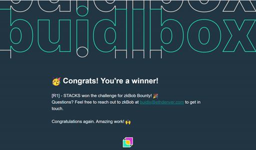
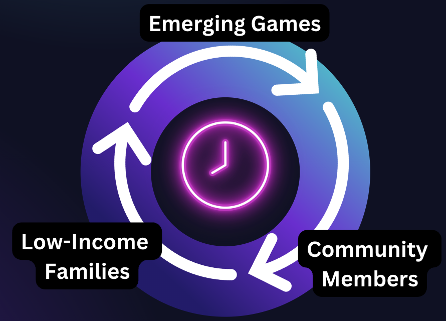
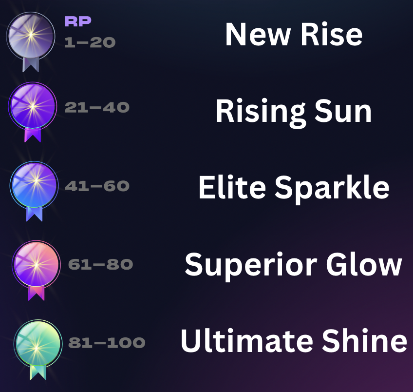
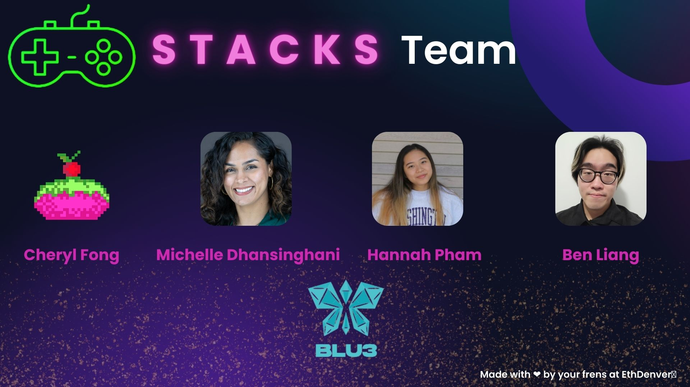

# STACKS

A social and community centric solution that aligns the  buying power of bargain gamers with the interests of indie game developers.

STACKS is a [ETH Denver Hackathon](https://ethereumdenver.medium.com/ethdenver-2023-track-and-bounty-winners-1d9cbeda1dc8) ZKBob Bounty Winner of USD 2500! 

## Pitch

<!-- VIDEO -->

📹 [Pitch Video](https://www.youtube.com/watch?v=TR1CISp6VVg)

👀 [Slide Deck](/public/stacks_slide_deck.pdf)

<!-- Problems/challenges addressed -->

<!-- The solution -->

<!-- Why is this important to us? -->

## User Flow Chart

[User Flow Chart](./public/dapp.drawio.png)

[See a live interface mockup](https://bumblebee-raccoon-m7we.squarespace.com/https://bumblebee-raccoon-m7we.squarespace.com/)

#### Partner + Community 
We partner with emerging games  to launch new games and acquire players

Profits funnel into a fund that will  be donated to low-income families. 

## Business Model

### CIRCULAR ECONOMY

### GAMIFYING STACKS

 

## The Team

